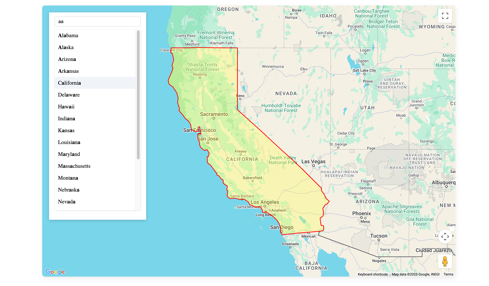

# State Typeahead Search

## Overview
A web app that allows users to quickly search and highlight U.S. states on a Google Map. It supports autocomplete searching and visually highlights selected states.

## Tech Stack:
- **Frontend**: Vue 3, Vite, Apollo Client, Google Maps API
- **Backend**: Node.js, Apollo Server, GraphQL, MongoDB (Dockerized)

## How to set up locally:

1. Clone this repository:
```bash
git clone <repo-url>
cd project
```

2. Ensure the startup script is executable (only first time):
```bash
chmod +x start.sh
```

3. Start the app (frontend, backend, MongoDB all at once):
```bash
./start.sh
```

- Frontend: [http://localhost:5173](http://localhost:5173)
- Backend GraphQL Playground: [http://localhost:4000/graphql](http://localhost:4000/graphql)

## Example Result

### Frontend

After running the project, you should see:



### Backend (GraphQL API)

You can verify the backend by sending a GraphQL query like this:

**Query:**
```graphql
query {
  states(name: "fl") {
    id
    name
    geometry {
      type
      coordinates
    }
  }
}
```

